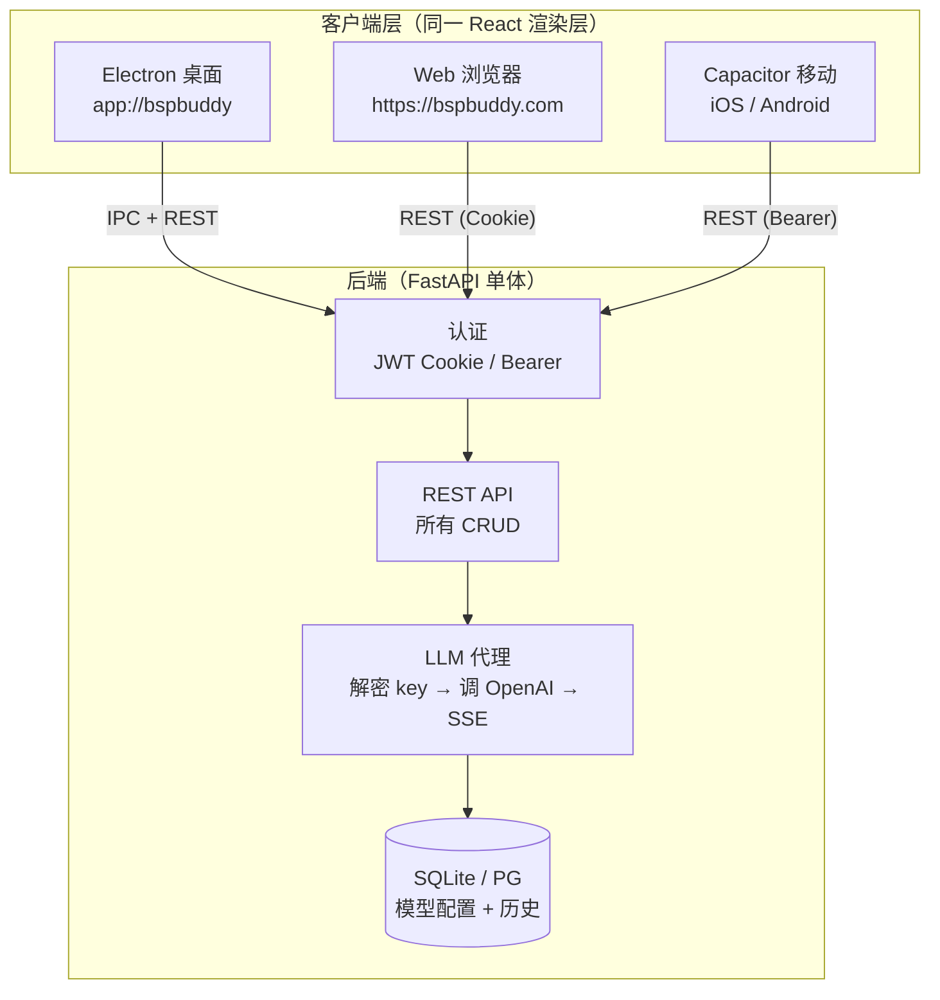

# BspBuddy 多端统一架构设计

> Status: 🟡 P0 进行中（Phase 1–3 已完成，Phase 4–5 待进一步铺开）

## 核心原则（参考 AgentCore）

> **"单一渲染层 + 平台壳 + 后端代理 LLM + 能力门禁降级"**

- 同一套 React 渲染代码产出桌面（Electron）/ Web（Vite SPA）/ 移动（Capacitor）三个目标
- 后端是 LLM 调用的唯一代理——解密 API key、调 OpenAI、SSE 流回前端
- 前端永远不见明文 API key，只传 provider 选择
- 平台差异通过 `capabilities.ts` 门禁控制，不做代码分叉

## 目标架构



## Phase 1: 后端 LLM 代理（核心重构）✅ 已完成

### 目标
把当前 `EXECUTE_TASK` handler 里的本地 `AIService` 直接调 OpenAI 的逻辑，改成后端代理。

### 改动范围

**后端新增**：
- `backend/app/api/chat_proxy.py` — `POST /api/chat/proxy/send` 和 `/stream` 端点
- `backend/app/core/llm_proxy.py` — 从 DB 读 ModelConfig → decrypt_secret → 用 OpenAI SDK 调用
- 依赖：`openai` Python 包（已在 `pyproject.toml` 中）

**前端改动**：
- `src/main/services/ipc-handlers.ts` — `EXECUTE_TASK` handler 优先调后端 `chat/proxy/send`，回退本地
- `src/main/services/ai.ts` — 标记 `@deprecated`
- `src/main/services/model-config-local.ts` — **已删除**

### 数据流变化

```
改前: ModelSelector → IPC → 读 model-configs.json → new AIService(key) → 直连 OpenAI
改后: ModelSelector → IPC → fetch /api/chat/proxy/send → 后端解密 key → 调 OpenAI
```

### 收益
- API key 只存后端一份（Fernet 加密），消灭明文泄露面
- 桌面 / Web / 移动用同一端点

## Phase 2: Web 构建目标 ✅ 已完成

### 新增文件

| 文件 | 说明 |
|------|------|
| `apps/web/vite.config.ts` | 独立 Web SPA 构建配置（原 `vite.webapp.config.ts`） |
| `apps/web/main.tsx` | Web 入口，加载 browserStubs 后渲染 App |
| `apps/web/browserStubs.ts` | Mock Electron API → REST HTTP client |
| `apps/web/index.html` | Web SPA HTML 入口 |
| `src/lib/capabilities.ts` | 能力门禁函数 |

### 平台入口统一到 apps/

```
apps/
├── desktop/              ← Electron 三入口
│   ├── main/index.ts     ← electron-vite 主进程入口
│   ├── preload/index.ts  ← preload 桥
│   └── renderer/         ← renderer HTML + React 入口
│       ├── index.html
│       └── main.tsx
├── web/                  ← Web SPA 入口
│   ├── index.html
│   ├── main.tsx
│   ├── browserStubs.ts
│   └── vite.config.ts
└── mobile/               ← Capacitor 移动端
    ├── capacitor.config.ts
    ├── package.json
    ├── vite.config.ts
    ├── index.html
    └── src/
        ├── main.tsx
        ├── storage.ts
        └── api/client.ts

src/                      ← 三端共享代码
├── lib/                  ← 类型、IPC channels、capabilities、client
├── hooks/                ← useAgent、useSession 等
├── components/           ← 所有 React 组件
├── renderer/             ← App.tsx + index.css（共享渲染根）
└── main/services/        ← Electron services（仅桌面端引用）
```

### 构建入口配置

- 桌面: `electron.vite.config.mjs` → 主进程 `apps/desktop/main/index.ts`、preload `apps/desktop/preload/index.ts`、renderer `apps/desktop/renderer/`
- Web: `apps/web/vite.config.ts` → `npm run build:web`
- 移动: `apps/mobile/vite.config.ts` → `npm run build:mobile`

### 改动文件

- `src/components/SettingsPanel.tsx` — 桌面专属项受 `hasDesktopIPC()` 门禁

## Phase 3: 移动端壳 ✅ 已完成

### 新增目录

```
apps/mobile/
├── capacitor.config.ts        # Capacitor 壳
├── vite.config.ts             # 移动端 Vite
├── index.html                 # 移动端入口 HTML
├── package.json               # 移动端依赖
└── src/
    ├── main.tsx               # 入口（注入 SecureStorage）
    ├── api/client.ts          # REST 客户端（Bearer 认证 + 单飞行 token 刷新）
    └── storage.ts             # Storage Seam
```

## Phase 4: 能力门禁全面覆盖 🟡 部分完成

### 门禁清单（已实现）

```typescript
// src/lib/capabilities.ts
isWebRuntime()         → 非 Electron 环境
hasLocalFiles()        → 桌面 ✅ | Web ❌
hasNativeSave()        → 桌面 ✅ | Web ❌
hasLocalEngine()       → 桌面 ✅
hasTerminalRun()       → 桌面 ✅
hasAutoUpdater()       → 桌面 ✅
hasDesktopIPC()        → 桌面 ✅
hasSecureStorage()     → 移动 ✅（预留）
```

### 待铺开

- [ ] `src/components/ChatPanel.tsx` — 文件选择器降级
- [ ] `src/renderer/App.tsx` — Web 模式隐藏桌面专属导航

## Phase 5: 认证统一 ✅ 基础完成

### 已改动

- `src/main/services/fastapi-bridge.ts` — `tenant_id` 从硬编码改为 JWT 提取（回退 `tenant_demo`）
- 移动端 `api/client.ts` — Bearer 认证 + 单飞行 token 刷新

### 待后续

- [ ] 前端独立登录页
- [ ] 后端 Cookie 域统一（`app://bspbuddy` / `localhost` / `capacitor://localhost`）

## 实现文件索引

```
backend/app/core/llm_proxy.py             — LLM 代理服务
backend/app/api/chat_proxy.py             — 代理 REST 端点
backend/app/main.py                       — 路由注册
vite.webapp.config.ts                     — Web 构建配置
src/renderer/main.webapp.tsx              — Web 入口
src/renderer/preview/browserStubs.ts      — 浏览器桩
src/lib/capabilities.ts                   — 能力门禁
src/main/services/ipc-handlers.ts         — EXECUTE_TASK 重构
src/main/services/ai.ts                   — deprecated
src/main/services/fastapi-bridge.ts       — 认证统一
src/components/SettingsPanel.tsx          — 门禁适配
apps/mobile/                              — 移动端壳
```

## 分期落地建议

| Phase | 内容 | 优先级 | 状态 |
|-------|------|:--:|:--:|
| 1 | 后端 LLM 代理（核心重构） | P0 | ✅ |
| 2 | Web 构建目标 + BrowserStubs + 能力门禁 | P1 | ✅ |
| 3 | 移动端 Capacitor 壳 | P2 | ✅ |
| 4 | 能力门禁全面铺开（UI 适配三端） | P2 | 🟡 |
| 5 | 认证统一（登录页 + Cookie/Bearer） | P2 | 🟡 |
